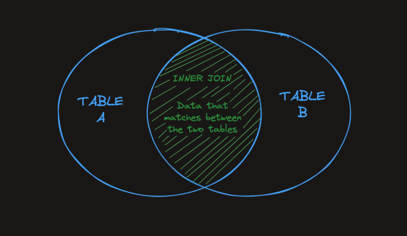

# Joins
Joins are one of the most important features that SQL offers. Joins allow us to make use of the relationships we have set up between our tables. In short, joins allow us to query multiple tables at the same time.

## Inner Join
The simplest and most common type of join in SQL is the INNER JOIN. By default, a JOIN command is an INNER JOIN. An INNER JOIN returns all of the records in table_a that have matching records in table_b as demonstrated by the following Venn diagram.


## On
To perform a table join, we need to tell the database how to "match up" the rows from each table. The ON clause specifies the columns from each table that should be compared.
```
SELECT *
FROM employees
INNER JOIN departments
ON employees.department_id = departments.id;
```
In this query:
- employees.department_id refers to the department_id column from the employees table.
- departments.id refers to the id column from the departments table.

## Namespacing on Tables
When working with multiple tables, you can specify which table a field exists on using a .. For example:
`table_name.column_name`
```
SELECT students.name, classes.name
FROM students
INNER JOIN classes ON classes.class_id = students.class_id;
```
The above query returns the name field from the students table and the name field from the classes table.

## Left Join
A `LEFT JOIN` will return every record from table_a regardless of whether or not any of those records have a match in table_b. A left join will also return any matching records from table_b. Here is a Venn diagram to help visualize the effect of a LEFT JOIN.


A small trick you can do to make writing the SQL query easier is define an alias for each table. Here's an example:
```
SELECT e.name, d.name
FROM employees e
LEFT JOIN departments d
ON e.department_id = d.id;
```