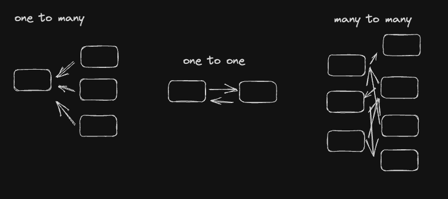

# Normalization

## Table Relationships
1. One-to-one
2. One-to-many
3. Many-to-many



### One to one
A one-to-one relationship most often manifests as a field or set of fields on a row in a table. For example, a user will have exactly one password.

Settings fields might be another example of a one-to-one relationship. A user will have exactly one email_preference and exactly one birthday.

### One to Many
A one-to-many relationship occurs when a single record in one table is related to potentially many records in another table.

- A customers table and an orders table. Each customer has 0, 1, or many orders that they’ve placed.
- A users table and a transactions table. Each user has 0, 1, or many transactions that they’ve taken part in.
```
CREATE TABLE customers (
    id INTEGER PRIMARY KEY,
    name TEXT NOT NULL
);

CREATE TABLE orders (
    id INTEGER PRIMARY KEY,
    amount INTEGER NOT NULL,
    customer_id INTEGER,
    CONSTRAINT fk_customers
    FOREIGN KEY (customer_id)
    REFERENCES customers(id)
);
```

### Many to Many
A many-to-many relationship occurs when multiple records in one table can be related to multiple records in another table.

- A products table and a suppliers table - Products may have 0 to many suppliers, and suppliers can supply 0 to many products.
- A classes table and a students table - Students can take potentially many classes and classes can have many students enrolled.

**Joining Table**
Joining tables help define many-to-many relationships between data in a database. As an example when defining the relationship above between products and suppliers, we would define a joining table called products_suppliers that contains the primary keys from the tables to be joined.

When enforcing specific schema constraints we may need to enforce the UNIQUE constraint across two different fields.
```
CREATE TABLE product_suppliers (
  product_id INTEGER,
  supplier_id INTEGER,
  UNIQUE(product_id, supplier_id)
);
```
This lets multiple rows share the same product_id or supplier_id, but it prevents any two rows from having both the same product_id and supplier_id.

## DB Normalization
Helps Improve data integrity and reduce data redundancy

### What is Data Integrity?
"Data integrity" refers to the accuracy and consistency of data. For example, if a user's age is stored in a database, rather than their birthday, that data becomes incorrect automatically with the passage of time.

## What is Data Redundancy?
"Data redundancy" occurs when the same piece of data is stored in multiple places. For example: saving the same file multiple times to different hard drives.

Data redundancy can be problematic, especially when data in one place is changed such that the data is no longer consistent across all copies of that data.

## Normal Forms

### 1st Normal Form
- It must have a unique primary key.
- A cell can't have a nested table as its value (depending on the database you're using, this may not even be possible)
The simplest way (but not the only way) to get into first normal form is to add a unique id column.

| id	| name	| age	| email |
| ----------- | ----------- | ----------- | ----------- |
| 1	| Lane	| 27	| lane@boot.dev |
| 2	| Lane	| 27	| lane@boot.dev |
| 3	| Allan	| 27	| allan@boot.dev | 

### 2nd Normal Form
A table in second normal form follows all the rules of 1st normal form, and one additional rule which only applies to composite primary keys:

All columns that are not part of the primary key are dependent on the entire primary key, and not just one of the columns in the primary key.

You should probably default to keeping your tables in second normal form. That said, there are good reasons to deviate from it, particularly for performance reasons. The reason being that when you have to query a second table to get additional data it can take a bit longer.

### 3rd Normal Form
A table in 3rd normal form follows all the rules of 2nd normal form, and one additional rule:

All columns that aren't part of the primary key are dependent solely on the primary key.

### Boyce-Codd Normal Form (BCNF)
A table in Boyce-Codd normal form (created by Raymond F Boyce and Edgar F Codd) follows all the rules of 3rd normal form, plus one additional rule:
- A column that's part of a primary key can not be entirely dependent on a column that's not part of that primary key.